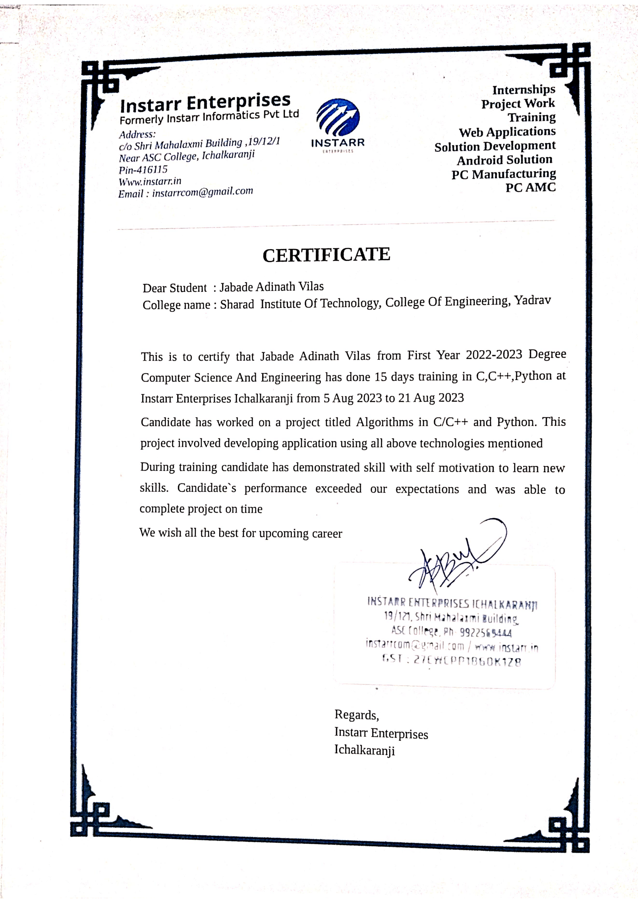

# DSA Java Practice

Java DS & Algorithms practice — collection of implementations for arrays, 2D arrays, recursion and string problems (completed during an Instarr internship).

This repository contains a collection of Java practice programs implementing common data-structure and algorithm exercises. The code is grouped by topic to make navigation simple (arrays, 2D arrays, recursion, strings, and a few miscellaneous practice files).

## Table of contents

- [Internship](#internship)
- [Repository structure](#repository-structure)
- [Build & run](#build--run)
- [Cleanup and .gitignore recommendations](#cleanup-and-gitignore-recommendations)
- [Publish to GitHub](#publish-to-github)

## Internship

These practice exercises were completed during a training internship at Instarr Enterprises (Instarr Informatics Pvt Ltd) in Aug 2023. The internship covered algorithms and small projects using C, Java, and Python; the code in this repository contains Java implementations and practice programs completed during/after that training period.



## Repository structure

- `*.java` — top-level practice files (simple programs and pattern exercises)
- `Arrays/` — array problems (two-pointer, sliding window, rotate, remove duplicates, etc.)
- `Arrays 2D/` — 2D array problems (traversal, transpose, spiral, row/col sums)
- `Recursion/` — recursion examples (factorial, fibonacci, printing sequences)
- `Strings/` — string problems (anagram, palindrome, non-repeating chars)

Example notable files:

- `advancePatterns.java`, `firstPattern.java`, `arrayPractice.java`, `recursionPractice.java`, `reverseString.java`, `functions_Methods.java`, `practiceStringQue.java`
- `Arrays/`: `diplicate.java`, `minMax.java`, `missingNum.java`, `moveZeros.java`, `prefixSum.java`, `removeDuplicate.java`, `reverseArray.java`, `rotateArray.java`, `subArraySum_slidingWindow.java`, `twoSum_twoPointer.java`
- `Arrays 2D/`: `col_wise_sum.java`, `find_Element.java`, `row_wise_sum.java`, `spiral.java`, `sum.java`, `transpose.java`, `traversal_2D_Array.java`, `wave_print.java`
- `Recursion/`: `factorial.java`, `fibonacci.java`, `printNToOne.java`, `printOneToN.java`, `sum.java`
- `Strings/`: `anagram.java`, `countVowelsConsonants.java`, `non_repeatingChar.java`, `palindrome.java`, `reverseString.java`

If any listed files are outdated or you want to rename/organize them differently, I can help automate that refactor.

## Description

A curated collection of Java practice programs and algorithm exercises (arrays, 2D arrays, recursion, strings, etc.), implemented while training at Instarr Enterprises. Includes example solutions, pattern programs, and simple runnable files to help learn core data structures and algorithms.

## What you'll find (highlights)

- Implementations: sliding window, two-pointer, prefix-sum, rotate, remove-duplicates, subarray sum
- 2D array: spiral traversal, transpose, row/column sums, wave print
- Recursion: factorial, fibonacci, sequence printing, sum examples
- Strings: anagram check, palindrome, non-repeating character, vowel/consonant counts
- Pattern and utility exercises (top-level `.java` files)
- Internship context: completed during training at Instarr Enterprises (certificate included as `Instarr.png`)

## Suggested GitHub topics

`java`, `algorithms`, `data-structures`, `dsa`, `interview-prep`, `practice`, `arrays`, `recursion`, `strings`

## Build & run

This project is a plain collection of `.java` files (no build system). Steps below assume you have a JDK installed and `javac` + `java` are available on your PATH.

Compile a single file:

```powershell
javac path\to\File.java
```

Compile all `.java` files recursively from the repository root (PowerShell):

```powershell
Get-ChildItem -Recurse -Filter '*.java' | ForEach-Object { javac $_.FullName }
```

Run a compiled class (if class is `Example` with `public static void main`):

```powershell
java Example
```

Notes:
- If your classes include `package` statements, run `javac` from the project root and use the fully-qualified name when running (for example `java com.example.Main`).
- If some files depend on each other, compile the whole set together (see the recursive compile above).

## Cleanup and .gitignore recommendations

This repo currently contains compiled `.class` files. Before publishing to GitHub, remove compiled files and keep only source files. A `.gitignore` has already been added to ignore `*.class` and common IDE files.

To remove existing `.class` files from git (if you already committed them):

```powershell
# Remove .class files from the working tree and from the index (keeps files locally but removes from git)
Get-ChildItem -Recurse -Filter '*.class' | ForEach-Object { git rm --cached $_.FullName }
git commit -m "Remove compiled class files"
```

If you want to delete `.class` files from the filesystem as well:

```powershell
Get-ChildItem -Recurse -Filter '*.class' | Remove-Item
```

## Publish to GitHub

A quick checklist to create a new Git repo locally and push to GitHub (run these from `d:\DSA_java_practice`):

```powershell
git init
git add .
git commit -m "Initial commit: add Java practice exercises and README"

# Create a remote repository using GitHub website OR GitHub CLI
# With GitHub CLI (gh must be installed and authenticated):
# gh repo create <username>/DSA_java_practice --public --source=. --push

# Or add remote manually and push
# git remote add origin https://github.com/<username>/DSA_java_practice.git
# git branch -M main
# git push -u origin main
```

Replace `<username>` with your GitHub username. Tell me if you want me to run the local `git init` + commit here and/or create & push the remote repo for you.

## Suggestions & next steps

- Add a `LICENSE` (MIT recommended if you want permissive reuse).
- Add a short `CONTRIBUTING.md` and `CODE_OF_CONDUCT.md` if you plan to accept contributions.
- Consider removing compiled `.class` files and keeping the repository focused on `.java` source files only.
- Optionally add small unit tests or a simple build script (Gradle/Maven) if you want to demonstrate compilation/test automation.

---

If you want, I can apply these README changes directly, add the certificate image, remove `.class` files from git, and run the `git init` + commit locally. Tell me which actions you'd like me to take next.


